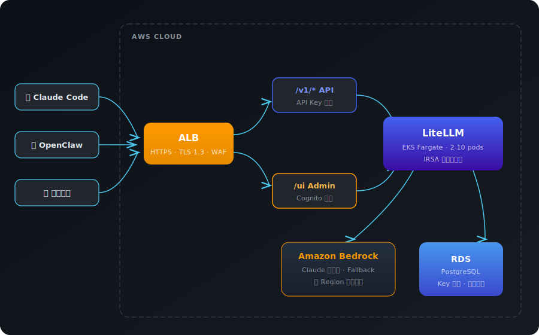

# LiteLLM on EKS — 基于 Bedrock 的企业级 AI 网关

[🇺🇸 English](README.en.md)

一键在 AWS 上部署 LiteLLM 代理，让团队通过统一 API Key 使用 Bedrock Claude 全系列模型。开箱即用对接 Claude Code 和 OpenClaw。

## 为什么需要 LiteLLM？

Bedrock 已经提供了无服务器推理、跨 Region 负载均衡和 IAM 鉴权。但企业多团队使用时，还需要：

- **per-user API Key** — 每人独立配额，离职即撤销，不暴露 AWS 凭证
- **实时用量仪表盘** — 按人 / 团队 / 模型维度拆账，不用等月底 CUR
- **自动 Fallback** — Opus 超时切 Sonnet 切 Haiku，跨模型容灾
- **双 API 格式** — OpenAI + Anthropic 格式同时支持，Claude Code / Cursor / OpenClaw 零改造接入
- **per-key 限速限额** — 防止单人打爆 Bedrock 配额

Bedrock 管模型和推理，LiteLLM 管人和成本。

## 架构

<p align="center">
  
</p>

## 特性

- **Bedrock Claude 全系列** — Opus 4.6/4.5, Sonnet 4.6/4.5/3.7/3.5, Haiku 4.5，通配符路由 `bedrock/*`
- **完整降级链** — 自动 Fallback，3 次失败后切换备用模型
- **零静态凭证** — EKS IRSA（IAM Roles for Service Accounts），无需管理 AWS Access Key
- **Serverless 计算** — EKS Fargate，按需付费无需管理节点
- **RDS PostgreSQL** — API Key 管理 + Admin UI + 使用量统计
- **可选安全增强** — WAF 速率限制 + Cognito 用户认证（Admin UI / Dashboard 等非 API 接口通过 Cognito 登录保护，API 接口走 API Key 认证，两套鉴权互不干扰）

## 前置条件

- AWS CLI v2（已配置凭证）
- Terraform >= 1.5
- kubectl、Helm 3、envsubst（`gettext` 包）
- 域名 + ACM 证书（可选，无域名时使用 ALB DNS 直连）

## 快速开始

```bash
git clone https://github.com/cncoder/serverless-litellm.git
cd serverless-litellm

# 交互式一键部署（约 15-20 分钟）
./scripts/setup.sh
```

脚本完成后会输出：
- LiteLLM 地址（`https://litellm.example.com` 或 ALB DNS）
- Master Key（存储在 AWS Secrets Manager）

## 创建 API Key

部署完成后，通过 LiteLLM Admin UI 管理 API Key：

1. 访问 `https://<your-domain>/ui`
2. 使用 Master Key 登录
3. 在 Keys 页面创建、查看、删除 API Key

## 配置 Claude Code

推荐使用 `settings.json` 一键配置，**只需替换 2 个值**：

```bash
mkdir -p ~/.claude
cat > ~/.claude/settings.json << 'EOF'
{
  "$schema": "https://json.schemastore.org/claude-code-settings.json",
  "env": {
    "ANTHROPIC_BASE_URL": "https://<your-domain>",
    "ANTHROPIC_API_KEY": "<your-litellm-key>"
  },
  "model": "claude-sonnet-4-6",
  "smallFastModel": "claude-haiku-4-5"
}
EOF

claude --print "hello"
```

切换模型：

```bash
claude --model claude-opus-4-6       # Opus 最强推理
claude --model claude-sonnet-4-6     # Sonnet 均衡（默认）
claude --model claude-haiku-4-5      # Haiku 快速响应
claude --model opus                  # 短名也支持
```

### Prompt Caching ✅

Bedrock 原生支持 Prompt Caching，Claude Code 通过 LiteLLM 自动生效，**无需额外配置**：

- Cache read 仅为基础 input 成本的 **10%**（~90% 节省）
- 最多 4 个 cache checkpoint，默认 5 分钟 TTL
- 经实测验证：2860 tokens 首次写入 → 后续请求全部命中缓存

### 从 Bedrock 直连迁移

如果之前直接使用 Bedrock，需删除 settings.json 中的冲突字段：`CLAUDE_CODE_USE_BEDROCK`、`AWS_REGION`、`ANTHROPIC_MODEL`。

> 详细说明见 [docs/claude-code.md](docs/claude-code.md)（含完整迁移 diff、Troubleshooting）

## 配置 OpenClaw

[OpenClaw](https://github.com/openclaw/openclaw) 是开源 AI 助手框架，支持 Discord/Telegram/Slack 等平台。通过 LiteLLM 接入 Bedrock：

```json
{
  "models": {
    "providers": {
      "litellm": {
        "baseUrl": "https://<your-domain>/v1",
        "apiKey": "<your-litellm-key>",
        "api": "openai-completions",
        "models": [
          { "id": "claude-sonnet-4-6", "name": "Claude Sonnet 4.6", "contextWindow": 200000, "maxTokens": 16384 }
        ]
      }
    }
  },
  "agents": { "defaults": { "model": "litellm/claude-sonnet-4-6" } },
  "gateway": { "mode": "local" }
}
```

> 详细说明见 [docs/openclaw.md](docs/openclaw.md)

## 文档

| 文档 | 说明 |
|------|------|
| [docs/architecture.md](docs/architecture.md) | 架构设计详解（EKS, IRSA, Fargate, 网络拓扑） |
| [docs/openclaw.md](docs/openclaw.md) | OpenClaw AI 助手框架集成 + Amazon DCV 远程桌面 |
| [docs/claude-code.md](docs/claude-code.md) | Claude Code 配置、1M context、模型选择 |
| [docs/API_USAGE.md](docs/API_USAGE.md) | OpenAI SDK / Anthropic SDK / cURL 调用示例 |
| [docs/models.md](docs/models.md) | 可用模型列表、Fallback 链、路由策略 |
| [docs/bedrock-monitoring-guide.md](docs/bedrock-monitoring-guide.md) | Bedrock 用量监控与成本分析 |
| [docs/manual-deploy.md](docs/manual-deploy.md) | 手动部署步骤（Terraform 变量、两阶段 ACM） |
| [docs/testing-guide.md](docs/testing-guide.md) | 完整测试指南（功能 / 性能 / HA / 安全） |
| [docs/troubleshooting.md](docs/troubleshooting.md) | 故障排查手册（真实生产环境经验） |
| [docs/e2e-test-report.md](docs/e2e-test-report.md) | 端到端测试报告（14 项全通过） |

## CloudFront + WAF 加固

部署完成后，建议通过 CloudFront + WAF 加固 ALB，实现三层防护：

1. **ALB Security Group** — 仅允许 CloudFront IP 段访问
2. **WAF Header 校验** — 阻止不经 CloudFront 的直接请求
3. **WAF 路径白名单** — 仅开放 API 路径，屏蔽 Admin UI 等管理接口

详见 [skills/cloudfront-waf-hardening/SKILL.md](skills/cloudfront-waf-hardening/SKILL.md)，包含完整操作步骤、路径白名单模板和回滚方案。

## 目录结构

```
.
├── terraform/          # 基础设施（EKS, VPC, RDS, ECR, WAF）
├── kubernetes/         # K8s 资源（Deployment, Service, Ingress, HPA）
├── scripts/
│   ├── setup.sh                # 一键部署
│   └── setup-claude-code.sh    # Claude Code 配置
├── skills/             # Claude Code Skills（可复用操作手册）
└── docs/               # 详细文档
```

## 超时与 LLM 调用限制

LLM 推理（尤其是 Opus）可能需要较长时间，各组件超时已预配置对齐：

| 组件 | 默认值 | 本项目配置 | 说明 |
|------|--------|-----------|------|
| CloudFront OriginReadTimeout | 30s | 60s（默认上限） | 首字节必须在 60s 内返回；**Streaming (SSE) 不受此限制**，首字节到达后流式传输无时间限制 |
| ALB Idle Timeout | 60s | 600s | 连接空闲超过此时间会被断开 |
| LiteLLM request_timeout | 600s | 600s | 代理层请求超时 |
| LiteLLM model timeout | 600s | 600s | 单模型调用超时，超时后触发 Fallback |
| K8s Ingress idle_timeout | 60s | 600s | ALB Ingress 注解配置 |

**常见问题：**

- **Claude Code 长时间推理中断？** — Claude Code 默认走 Streaming，CloudFront 60s 限制仅针对首字节。如果首字节超过 60s（极罕见），需向 AWS Support 申请提高 OriginReadTimeout 上限
- **非 Streaming 请求 504？** — 非流式调用（如 `/v1/completions` 不带 `stream:true`）受 CloudFront 60s 首字节限制，Opus 复杂推理可能超时。建议始终使用 `stream: true`
- **Fallback 触发过早？** — 检查 `configmap.yaml` 中 `timeout` 和 `num_retries` 配置，默认 3 次失败后切换备用模型
- **连接空闲断开？** — ALB idle timeout 600s，10 分钟内无数据传输会断开。正常 Streaming 场景不会触发

> 如需调整超时，修改 `kubernetes/configmap.yaml`（LiteLLM）和 `kubernetes/ingress.yaml`（ALB），CloudFront 需在 AWS 控制台或 CLI 修改。

## License

MIT
